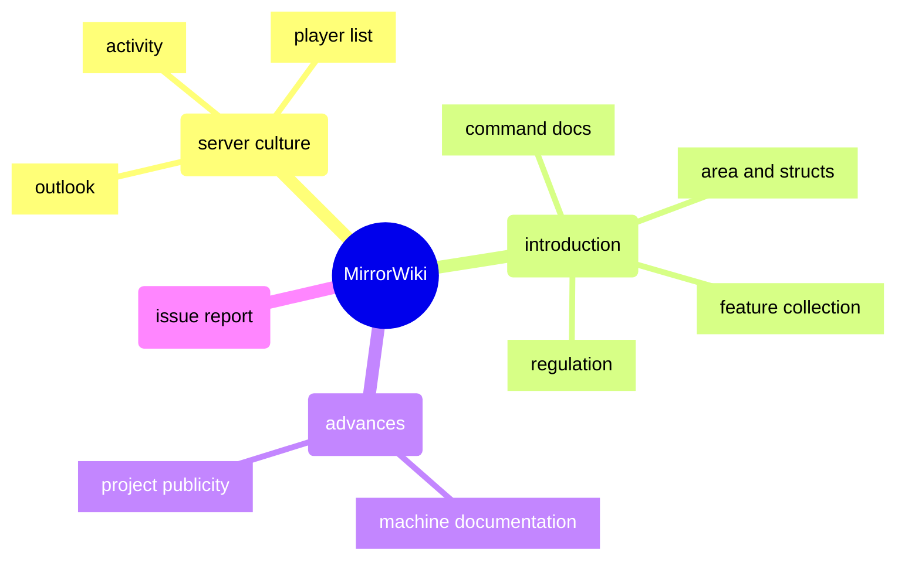

<a title="MirrorTree Wiki" href="https://wiki.mirror.bearcabbage.top/"></a>

# MirrorTree Wiki

[](https://www.npmjs.com/package/hexo-theme-next)
[](https://hexo.io)
[](https://github.com/MirrorTree-MC/MirrorTree/actions/workflows/github-code-scanning/codeql)
[](https://github.com/MirrorTree-MC/MirrorTree/actions/workflows/hexo.yaml)
[](https://creativecommons.org/licenses/by-nc-sa/4.0/)

> Once upon a time, there was a Mirror Tree.

## Introduction

The MirrorTree Wiki is currently organized following the diagram below.



Currently, we have an alternate [wiki site](https://wiki-mirror.bearcabbage.top/) that is being enhanced. That site is built on the MediaWiki engine and is anticipated to be more user-friendly and more convenient for content editing. While [@BaicaiBear](https://github.com/BaicaiBear) suggests that players participate in the alternative one to reduce the difficulty of making chioces between the two wikis, the current site remains under maintenance and continues to welcome contributions.

## About This Repository

> [!CAUTION]
> Contributors ought to look through this section throughly before editing the website.

### Local Deployment

You may follow the steps below to deploy the website locally. [Node.js](https://nodejs.org/zh-cn) is required for the deployment.

```bash
# clone the repository and install the dependencies
git clone https://github.com/MirrorTree-MC/MirrorTree.git
cd MirrorTree
npm install
```

```bash
# start the local server
hexo clean && hexo g -d
hexo s
```

### Core File Structure

```bash
.
├── source
│   ├── _posts # common posts
│   ├── docs   # documentation
│   │   ├── server        # culture of the server
│   │   ├── introduction  # introduction for freshers
│   │   ├── advanced-info # advanced information
│   │   └── issue.md      # problem solving
│   └── news   # mirror news
├── .gitignore
├── _config.next.yml # configuration of NexT theme
├── _config.yml      # configuration of Hexo
└──  README.md       # guidelines for contributors
```

> [!NOTE]
> Given that [Hexo](https://hexo.io/) has its own specific file structure as deploying a website, you may refer to the `pbulic` folder in the root directory as a reference while using internal links, which is the actual root directory of the internal links.

### Documentation Norm

The documentation should be clear and concise in order that problem dealing can be more efficient. You may follow the github markdown syntax when writing a document. Note that to insert a space between Chinese and English words is strongly recommended. See [Chinese Documentation Style Guide with Markdown](https://zhuanlan.zhihu.com/p/144446995) for more information.

> [!TIP]
> Trick-playing is recommended when writing a document, indicating your expressions needn't be that *wikism*.

In each page, you may add a table of page information (i.e. front matter) at the beginning of the document, which should be in the following format:

```markdown
---
title: abc
date: 2025-1-5 12:00:00
sticky: 90
tags:
  - xyz
---
```

> [!INFO]
> The table above actually serves as the h1 title of the page, which is to say, you may begin with `##`, i.e. the h2 title, in each page.

### Git Norm

A commit message should be clear and concise in order that problem dealing can be more efficient. It ought to be in the following format:

```git
<type>(<scoop>): <subject>
// <BLANK LINE>
<body>
// <BLANK LINE>
<footer>
```

- `<type>`: The type of the commit, such as `feat`, `fix`, `docs`, `style`, `refactor`, `test`, `chore`, etc.
- `<scoop>` (optional) : The scope of the commit, such as `algorithm`, `communication`, `archive`, etc.
- `<subject>`: A brief summary of the commit. It should be in the imperative mood without `dot (.)` at the end of a line.
- `<body>` (optional) : A detailed description of the commit.
- `<footer>` (optional) : A footer for the commit, such as `BREAKING CHANGE`, `ISSUES CLOSED`, etc.

> [!NOTE]
> Although pull requests are different from commits, you may follow the same format while writing a pull request.

## License

[](https://creativecommons.org/licenses/by-nc-sa/4.0/)

```plaintext
Copyright (c) 2024-2025 MirrorTree
Current version is Type M Edition 0.12
2025.1.1
```
