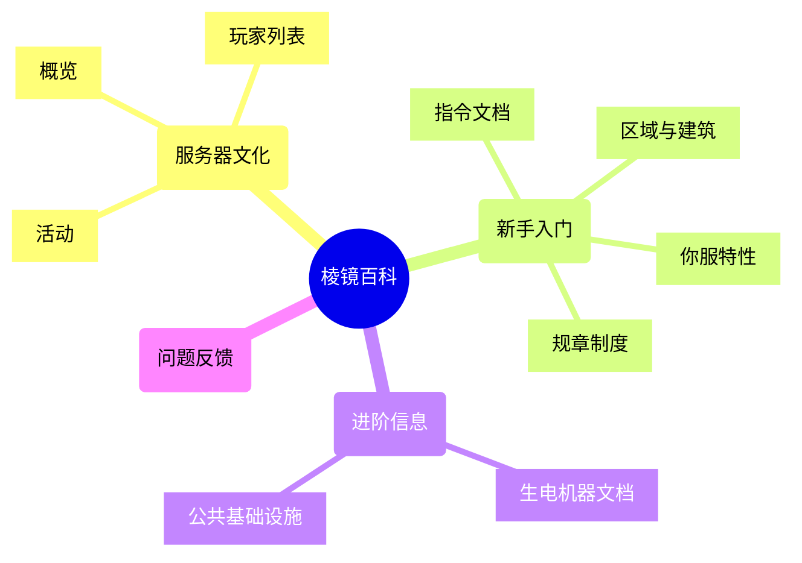

<a title="MirrorTree Wiki" href="https://wiki.mirror.bearcabbage.top/"></a>

# MirrorTree Wiki

[](https://www.npmjs.com/package/hexo-theme-next)
[](https://hexo.io)
[](https://creativecommons.org/licenses/by-nc-sa/4.0/)
[](https://github.com/MirrorTree-MC/MirrorTree/actions/workflows/hexo.yaml)

| [简体中文](./README_CN.md) | [English](./README.md) |
| :------------------------: | :--------------------: |

> 从前有棵棱镜树……

## 引言

MirrorTree Wiki（棱镜百科）目前的结构如下图所示。



> [!WARNING]
> 上述图示仅涵盖了网站的百科部分，其他分类未包含在内。

目前我们有一个正在完善的[备用 wiki 站点](https://wiki-mirror.bearcabbage.top/)。该站点基于 MediaWiki 引擎，预计会更加友好和便于内容编辑。[@BaicaiBear](https://github.com/BaicaiBear) 建议玩家优先参与备用 wiki，以减少在两个 wiki 之间选择的难度，但当前站点仍在维护中，欢迎继续贡献内容。

## 关于本仓库

> [!CAUTION]
> 贡献者在编辑网站前应仔细阅读本节内容。

### 本地部署

你可以按照以下步骤在本地部署网站。需要先安装 [Node.js](https://nodejs.org/zh-cn)。

```bash
# 克隆仓库并安装依赖
 git clone https://github.com/MirrorTree-MC/MirrorTree.git
 cd MirrorTree
 npm install
```

```bash
# 启动本地服务器
hexo clean && hexo s -g
```

### 核心文件结构

```bash
.
├── source
│   ├── _posts # 一般文章
│   ├── docs   # 参考文档
│   │   ├── server        # 服务器文化
│   │   ├── introduction  # 新手入门
│   │   ├── advanced-info # 进阶信息
│   │   └── issue.md      # 问题
│   └── news   # 森森新闻
├── .gitignore
├── _config.next.yml # NexT 主题配置
├── _config.yml      # Hexo 配置
└──  README.md       # 贡献者指南
```

> [!NOTE]
> 由于 [Hexo](https://hexo.io/) 部署网站时有其特定的文件结构，使用内部链接时可参考根目录下的 `public` 文件夹，该文件夹是内部链接的实际根目录。

### 文档规范

文档应简明清晰，以便更高效地处理问题。建议遵循 GitHub Markdown 语法进行编写。强烈建议在中英文之间添加空格。更多信息可参考 [中文文档写作风格指南](https://zhuanlan.zhihu.com/p/144446995)。

> [!TIP]
> 写文档时可以适当玩梗，不必太拘泥于维基百科风格。

每个页面开头可以添加一段页面信息表，格式如下：

```markdown
---
title: abc
date: 2025-1-5 12:00:00
sticky: 90
tags:
  - xyz
---
```

> [!NOTE]
> 上述表格实际上就是页面的 h1 标题，因此正文可直接从 `##`（h2 标题）开始。

### Git 规范

提交信息应简明清晰，以便更高效地处理问题。推荐格式如下：

```git
<type>(<scope>): <subject>
// <BLANK LINE>
<body>
// <BLANK LINE>
<footer>
```

- `<type>`：提交类型，如 `feat`、`fix`、`docs`、`style`、`refactor`、`test`、`chore` 等。
- `<scope>`（可选）：提交影响范围，如 `algorithm`、`communication`、`archive` 等。
- `<subject>`：简要描述，使用祈使句，末尾不加句号。
- `<body>`（可选）：详细描述。
- `<footer>`（可选）：如 `BREAKING CHANGE`、`ISSUES CLOSED` 等。

> [!NOTE]
> 虽然 Pull Request 与 commit 不同，但建议写 PR 时也遵循此格式。

## 许可证

[](https://creativecommons.org/licenses/by-nc-sa/4.0/)

```plaintext
Copyright (c) 2024-2025 MirrorTree
Current version is Type M Edition 1.12
2025.07.06
```
